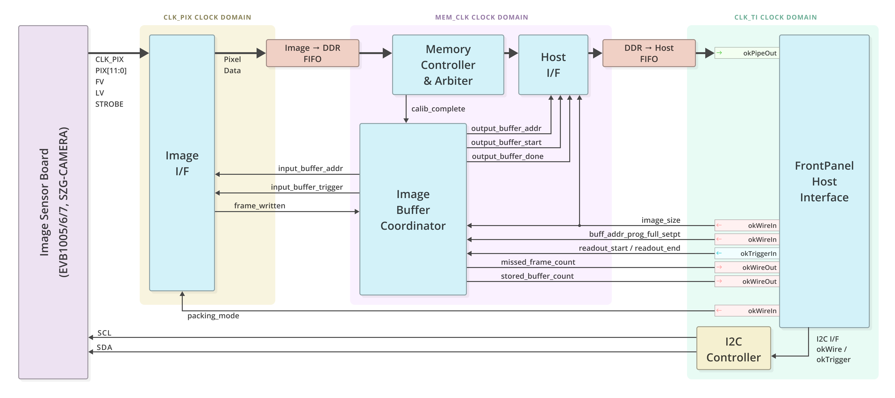

## Camera Example Design
- [Overview](overview.md)
- [Getting Started](getting-started.md)
- [Hardware](hardware.md)
- **Gateware**
- [Software (C++)](software-cpp.md)
- [Software (JS)](software-js.md)
- [Schematics and Drawings](schematics-and-drawings.md)
- [Release Notes](release-notes.md)

This Camera Example Design includes FPGA logic which performs the function of an image capture processor (ICP).  This logic is designed with Opal Kelly’s FrontPanel HDL so it may communicate with software using the FrontPanel API.  This section describes the architecture of the ICP so that you may use it as a starting point in your own applications.

There are a number of ways to apply the FrontPanel API and HDL to achieve image capture and processing with a given image sensor.  This ICP is just one example of architecture.  Others may be more efficient depending on the specific requirements at hand.  The architecture description below is not intended to be complete documentation for the ICP, just an overview of its design.  For further detail, please see the source code.

# Top-Level Architecture

# Clock Management

At FPGA configuration, the following clocks are available to the design:

- `CLK_TI` – This is the target interface (TI) clock from the FrontPanel okHost.  This clock is 48 MHz for USB 2.0 hosts and 100.8 MHz for USB 3.0 hosts.  This clock is used to sync data with the FrontPanel interface/components.
- `SYS_CLK`/`DDR_CLK` – These clocks come from on-board clock oscillators or PLLs on your Opal Kelly device. Some devices may include both, just the SYS_CLK, or neither.  They are typically used to produce the reference clock to various IPs like the MIG or MIPI D-PHY.
- `PIX_CLK` – This clock is used for clocking of the pixel-clock logic in the design. This clock comes from the image sensor board on all products except the SZG-MIPI-8320. In the case of SZG-MIPI-8320 this clock is produced by SYS_CLK and is used to clock an AXI stream interface.
- `MEM_CLK` – This clock is presented to the user by the MIG and is used to synchronize the data being read/written to the DDR memory.

When using the XEM6006 paired with the EVB100x, the FPGA is configured to output a 24MHz clock signal. For all other FPGA modules that utilize the EVB100x image module, the FPGA should output a 20MHz clock signal. The image sensor features an integrated Phase-Locked Loop (PLL) that is set up during the camera initialization sequence to produce a 96MHz pixel clock. This pixel clock is then forwarded to the FPGA and labeled as CLK_PIX. It’s worth noting that the SZG-MIPI-8320 image module does not require an external clock source; therefore, this note is not applicable to FPGA modules using this particular image module.

The general clock domain organization can be seen in the top-level architecture block diagram above. The clock domains are shaded behind the various blocks represented on that domain.

# Reset Logic

Multiple reset signals are delivered to the ICP from the host interface. These resets are asynchronous in relation to the various clock domains in the design. The ICP generates clock-domain-specific resets which assert asynchronously and deassert synchronously with the corresponding clock domain.

# Image Buffer Coordinator

We imagine the DDR memory space to contain chucks that can hold an entire image frame. The image buffer coordinator (`imgbuf_coordinator.v`) handles address pointers to these locations in memory. It provides the memory address that the image sensor interface (`image_if.v`) should write image data to and provides the host interface (`host_if.v`) with the memory address that it should read an image frame from.

A FIFO contains these memory address pointers. A pointer is written to the FIFO once a frame has been written to that location in DDR memory. An address can then be pulled from the FIFO to read a frame from that location in DDR memory. Two separate state machines handle the pointers on the input and output paths for this FIFO.

The image buffer coordinator’s only function is to provide these pointers to the host interface (`host_if.v`) and image sensor interface (`image_if.v`) submodules. It is then the responsibility of these submodules to request a read/write to the Memory Arbiter (`mem_arbiter.v`) which then ultimately stimulates the MIG interface to carry out the read/write operations to DDR memory.

A more in-depth description of the operation of the image buffer coordinator can be found in the header of `imgbuf_coordinator.v`.

# Memory Arbiter

The memory arbiter (`mem_arbiter.v`) will receive either read requests from the host interface (`host_if.v`) or write requests from the image sensor interface (`image_if.v`). The arbitrator has a state machine that gives preference to which path has the least CDC FIFO space (referenced in the submodules below) if there is a collision and will fulfill either request otherwise.

# Image Sensor Interface (ISI)

The image sensor interface (`image_if.v`) implements the write path. It contains the PHY that communicates to the image sensor. It has a state machine that observes the incoming image stream and places that data in a PIX_CLK<–>MEM_CLK CDC FIFO. It will receive a start address from the Image Buffer Coordinator (`imgbuf_coordinator.v`) and request to write a full frame from the memory arbiter (`mem_arbiter.v`) starting at that address. When the request is acknowledged the data from the FIFO is written to DDR memory.

For all products except the SZG-Camera and SZG-MIPI-8320 the state machine has a configuration input (PACKING_MODE) which specifies how incoming image data is packed into memory:

- 8-BPP – When PACKING_MODE=0, the eight most-significant bits of each 12-bit pixel are packed into the words written to memory.  The least-significant bits are discarded.  Since the memory interface is 64-bits wide, a memory word is written every eight pixel clocks.
- 16-BPP – When PACKING_MODE=1, each 12-bit pixel is padded with 0’s to a 16-bit word and packed into the words written to memory.  A memory word is written every four pixel clocks.

# Host Interface

The host interface (`host_if.v`) implements the read path. Upon receiving the start signal and read address pointer from the image buffer coordinator (`imgbuf_coordinator.v`) the host interface will request to read a full frame from the memory arbiter (`mem_arbiter.v`) starting at that address. When the request is acknowledged the data read from DDR memory is placed in a MEM_CLK <–> CLK_TI CDC FIFO.

# I2C Controller

In order to communicate with the image sensor’s register interface and configure the sensor, a simple I2C controller is provided.  This controller is commanded through the FrontPanel host interface using only Wires and Triggers. The documentation and source for the I2C controller is provided open-source in the `HDLComponents/I2CController` directory of our `opalkelly-opensource/design-resources` GitHub repository.

# Top Level Wrapper

The top level wrapper (`okcamera.v`) will instantiate all the aforementioned submodules as well as the FrontPanel HDL components. The FrontPanel HDL makes up the HDL portion of the FrontPanel interface system. These components communicate directly with a USB controller which then communicates with your host PC over USB. Using the FrontPanel software API you have direct access to wires, triggers, and data pipes into and out of the Camera Example Design. It is through this means that we control, observe, and extract data from this example design.

# Image Interface Wrapper (3 Camera)

The Image Interface Wrapper (`image_if_wrapper.v`) is only used in the 3 camera HDL architectures. It is a wrapper that contains three image sensor interface (`image_if.v`) modules. In this architecture the Image Buffer Coordinator (`imgbuf_coordinator.v`) imagines the DDR memory space to contain chucks that hold a total of 3 image frames. The Image Interface Wrapper will receive a start address from the Image Buffer Coordinator. The start address is given to the first camera’s `image_if` module and requests to write a full frame to the memory arbiter (`mem_arbiter.v`) starting at that address. A saved address for where the first camera stops writing to DDR is then sent to the second camera’s image_if. The second `image_if` then continues writing to DDR and this process continues for the third camera’s `image_if`. The address pointer to this three frame chunk is then saved to the address buffer FIFO in the image buffer coordinator.

# Pcam Sensor Notes

The SZG-MIPI-8320 can be used with the Digilent Pcam module which houses the Omnivision OV5640 color image sensor. We provide an example for the Pcam on the XEM8320.

## Register Dump

To configure the Omnivision OV5640 we used the register dump located within Digilents Pcam example design sources. They are available at their Github account in the Zybo-Z7-20-pcam-5c repository. You can find the various I2C command dumps within the OV5640.h file. Various dumps for auto white balance (AWB) and camera modes (1080p) were used.

## MIPI PHY

The Xilinx MIPI CSI-2 RX Subsystem core is used as the PHY to communicate with the Omnivision OV5640. This IP is available free of charge with purchase of a Vivado license. This will be required to build the example design as it is provided.

# Aptina Sensor Notes

At the time this documentation was written, the MT9P031 datasheet was published at Ref. F dated May 2011. There are a few notes and errata that should be mentioned. Aptina application support was very helpful in resolving these issues.

## Data Valid Window

Figure 29 of the datasheet represents the I/O Timing Diagram. According to Aptina, the correct way to interpret Tpd from this diagram and the timing characteristics is that data is valid as early as 0.8ns before the rising edge of PIXCLK. So the minimum time should probably be written as -0.8ns.

This modified timing is reflected in the constraints files provided in the Developer’s Release.

## Line Valid and Frame Valid at High Clock Rates

Pixel data, LV, and FV are launched from the sensor on the rising edge of PIXCLK and Aptina suggests capturing these on the falling edge. However, the maximum time from PIXCLK (rising edge) to LV and FV becoming valid is 5.9ns. At 96 MHz pixel rates, the clock period is 10.4ns. Therefore, these transitions would occur after the falling edge. This causes synchronization problems.

Aptina has released Technical Note TN-09-148 that addresses this issue. Their recommendation is to run the image sensor at 96 MHz, but enable an undocumented internal FIFO to allow pixel data to be read out during the horizontal blanking period. This makes the internal sensor clock run at 96 MHz, but the PIXCLK and data outputs are run at 72 MHz. Our software configures the image sensor according to this technical note.
