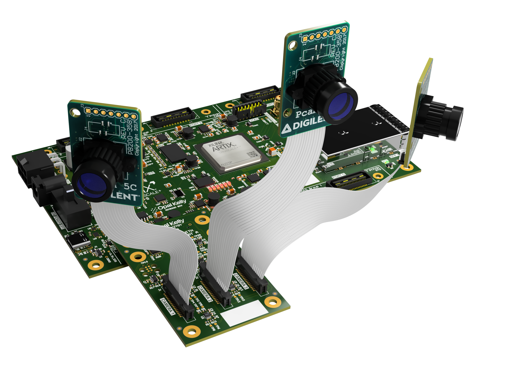
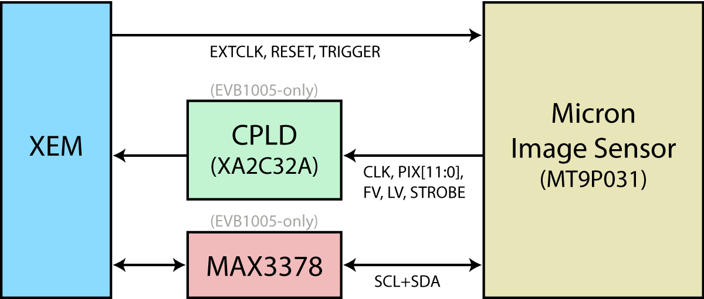
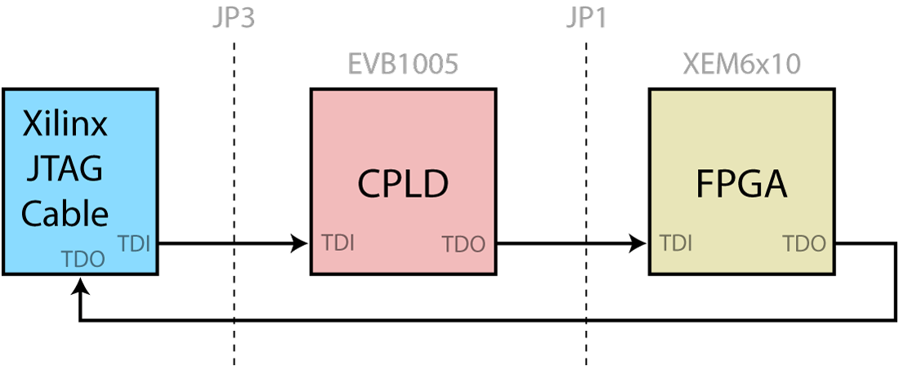

## Camera Example Design
- [Overview](overview.md)
- [Getting Started](getting-started.md)
- **Hardware**
- [Gateware](gateware.md)
- [Software (C++)](software-cpp.md)
- [Software (JS)](software-js.md)
- [Schematics and Drawings](schematics-and-drawings.md)
- [Release Notes](release-notes.md)

The EVB1005 is an image capture module for use with the Opal Kelly XEM6010, XEM6110, XEM3050, and XEM3010 FPGA modules.  The EVB1006 is a similar capture module for the Shuttle LX1 (XEM6006) or other FMC carrier.  Both modules include a Micron MT9P031I12STC 5 mega-pixel color image sensor and necessary power supply circuitry.  Designed as evaluation boards for Opal Kelly integration modules, the modules provide an excellent platform for getting accustomed to the FrontPanel SDK in a demanding, real-world application.

# Reference Hardware

## EVB1005

The EVB1005 is an image capture module for use with the following Opal Kelly FPGA modules:

- XEM3010
- XEM3050
- XEM6010 and XEM6310
- XEM6110
- XEM7010 and XEM7310

## EVB1006

- XEM6006
- XEM7350
- Other FMC carriers (untested)

## EVB1007

- ZEM4310
- Other HSMC carriers (untested)

## SZG-CAMERA

The [SZG-CAMERA](https://docs.opalkelly.com/syzygy-peripherals/szg-camera/) is a [SYZYGY](https://syzygyfpga.io/) Standard peripheral compatible with the following carrier products:

- XEM8320
- XEM7320
- Brain-1
- BRK8350
- BRK1900
- Other SYZYGY-compliant carriers (untested)

# Image Sensors

Different image sensors are used for the reference hardware peripherals. Some basic information about these sensors is listed below.

## Micron MT9P03 Sensor

The EVB1005/6/7 modules include a **Micron MT9P031I12STC** 5 Mpx color image sensor and necessary power supply circuitry.  Designed as evaluation boards for Opal Kelly integration modules, the modules provide an excellent platform for getting accustomed to the FrontPanel SDK.

- 1/2.5-inch, 5-Megapixel CMOS digital image sensor, 12-bit ADC resolution
- Active pixel array of 2592H x 1944V
- RGB Bayer color filter array
- Snapshot and Electronic rolling shutter
- 96 Mp/s readout rate
- Full resolution frame rate to 14 fps.  VGA frame rate to 53 fps.

## ON Semiconductor AR0330CM Sensor

The SZG-CAMERA module includes an **ON Semiconductor AR0330CM1C00SHAA0** 3.4 Mpx color image sensor.

- 1/3-inch 3.4-Megapixel CMOS digital image sensor, 12-bit ADC with A-law compression
- Active pixel array of 2304H x 1296V
- RGB Bayer color filter array
- Four-lane serial high-speed pixel interface (HiSPi)
- 196 Mp/s readout rate
- Full resolution frame rate to 60 fps

## MIPI Sensors

The SZG-MIPI-8320 hardware is designed to operate with a variety of MIPI sensors. Little information about the register interface for these sensors is available outside of a non-disclosure agreement. However, in some cases (such as the Digilent Pcam), enough information is provided to configure the device and provide sensible default output.

# Mechanical Information

The EVB1005 is designed to mate directly with the expansion bus on the XEM6010 and similar devices.  The dimensions of the board are identical to those of the XEM6010 so that the mating is natural and the combination can easily be handled.  The EVB1006 is a standard FMC device and is compatible with our Shuttle LX1 and most other FMC carriers.

Mechanical drawings of the modules are available in the [Schematics and Drawings](schematics-and-drawings.md) section.

## Lens and Lens Holder (included with EVB100x)

A high-quality glass lens, plastic lens holder, and mounting hardware are included with the EVB1005, EVB1006, and EVB1007.  The part and supplier information is listed below.  Sunex also has a higher-quality lens available with better optics, the DSL944.

| PART | DESCRIPTION | SUPPLIER |
|------|-------------|----------|
| CMT821 | Lens Holder | Sunex (www.optics-online.com) |
| DSL853C-650 | Glass Lens | Sunex (www.optics-online.com) |
| 92005A006 | Screw M1.6, 8mm, pan-head | McMaster-Carr |
| 90591A109 | Hex nut, M1.6, 0.35mm | McMaster-Carr |

## Lens and Lens Holder (included with SZG-CAMERA)

A high-quality glass lens, plastic lens holder, and mounting hardware are included with the SZG-CAMERA.  The part and supplier information is listed below.

| PART | DESCRIPTION | SUPPLIER |
|------|-------------|----------|
| CMT821 | Lens Holder | Sunex (www.optics-online.com) |
| DSL944-650-F2.8 | Glass Lens | Sunex (www.optics-online.com) |
| 92005A006 | Screw M1.6, 8mm, pan-head | McMaster-Carr |
| 90591A109 | Hex nut, M1.6, 0.35mm | McMaster-Carr |

# Functional Block Diagram (EVB1005)

# Power Supply

The EVB100x provides +2.8-v and +1.8-v using linear regulators from the +VDC power supply.

+2.8-v is used to power the image sensor’s internal analog circuitry as well as the I/O components.  The +1.8-v is used to power the image sensor’s internal digital circuitry and the CPLD.

## XEM6110

When attached to the XEM6110 (which does not have a power connector), the +VDC supply is provided to the EVB1005 through the barrel connector.  It must be within the range +4.5-v and +5.5-v.  The center conductor is power.  The ring conductor is ground.

+VDC is then provided through the expansion connector to the XEM6110.

## XEM6010, XEM3050, and XEM3010

When attached to the XEM6010, XEM3050, or XEM3010, the +VDC supply is provided to the EVB1005 through the expansion connector.  The external power supply may be connected to either the EVB1005 or the XEM, but only one supply should be attached at a time.

## XEM6006

The EVB1006 derives power from the FMC connector on the XEM6006.  A power connector is not available on the EVB1006.

# JTAG Chain

The EVB1005 has a 14-pin connector (JP3) which is compatible with the Xilinx Platform USB JTAG connector to allow JTAG programming of the CPLD as well as JTAG communication with the FPGA for ChipScope.

## XEM6010 and XEM6110

The JTAG chain when used with the XEM6010 and XEM6110 is shown in the diagram below.  The Xilinx JTAG adapter is attached to the EVB1005 and both the CPLD on the EVB1005 and the FPGA are part of the chain.

## XEM3010 and XEM3050

The JTAG chain is not configured to be used with the XEM3010 or XEM3050.

# Electrical Interfaces (EVB1005)

The EVB1005 was designed to operate with the default 3.3-volt I/O on the XEM6010 and XEM6110 devices.  Although both devices allow a daughterboard to set the VCCIO on each bank, this requires removal of a ferrite bead on the FPGA module.  To avoid this modification, voltage level translation is used instead.

The Micron image sensor digital I/O voltage can also be set to 1.8-v or 2.8-v, but even at the 2.8-volt level, the Output HIGH voltage is below the Input HIGH threshold of the Spartan-6 FPGA.

## I2C Interface

The image sensor uses an I2C interface for reading and writing several control registers that command the operation of the sensor, set acquisition gains and offsets, and determine how pixel readout is performed.

The HDL design will require a simple I2C controller to communicate with this interface.  A Maxim MAX3378EEUD+ is installed to perform the bidirectional level translation require for I2C interfaces.

## Pixel Interface

The Micron sensor is set to use 2.8-volts for VDDIO.  In this configuration, the unidirectional signals from the FPGA to the image sensor (`EXTCLK`, `RESET`, and `TRIGGER`) may be sent directly without level translation.

The unidirectional signals from the image sensor to the FPGA, however, go through a Xilinx CoolRunner II CPLD for level translation.  The bank facing the image sensor is set to +2.8-v.  The bank facing the FPGA is set to +VCCO, the FPGA’s bank voltage (+3.3v).

The CPLD programming files are included assets with the EVB100x Developer’s Release.

# Electrical Interfaces (EVB1006)

The EVB1006 is an FMC device and contains an EEPROM with IPMI configuration data that configures the FMC carrier for the proper interface voltages.  Due to this electrical definition of the interface voltage, no jumpers or ferrite beads need to be manipulated.

## I2C Interface

The image sensor uses an I2C interface for reading and writing several control registers that command the operation of the sensor, set acquisition gains and offsets, and determine how pixel readout is performed.

The HDL design will require a simple I2C controller to communicate with this interface.  A Maxim MAX3378EEUD+ is installed to perform the bidirectional level translation required for I2C interfaces.

## Pixel Interface

The Micron sensor is set to use 2.8-volts for VDDIO.  The FMC interface is configured to a 2.5-v I/O voltage compatible with the Spartan-6 FPGA.  In this configuration, the unidirectional signals from the FPGA to the image sensor (`EXTCLK`, `RESET`, and `TRIGGER`) may be sent directly without level translation and will satisfy the sensor’s input thresholds.  Similarly, the image sensor outputs may be sent directly to the FPGA without level translation.  The higher output voltage is below the recommended operating input voltage for the Spartan-6 and will not cause damage.

# Sensor to FPGA Pin Mapping

The table below lists the pin mapping from the sensor to the FPGA on the XEM6010, XEM6110, XEM3010, XEM3050, and XEM6006 (EVB1006).

| SENSOR | DIRECTION | XEM6010 / XEM6110 | XEM3010 | XEM3050 | XEM6006 |
|--------|-----------|-------------------|---------|---------|---------|
| `EXTCLK` | O | A11 | F9 | B13 | C10 |
| `RESET` | O | A15 | D1 | H3 | E7 |
| `TRIGGER` | O | C15 | E2 | H4 | E8 |
| `SCLK` | O | A13 | E1 | J2 | A14 |
| `SDATA` | I/O | C13 | F2 | J3 | F10 |
| `STROBE` | I | A7 | H3 | L1 | D11 |
| `PIXCLK` | I | C11 | E9 | A13 | E10 |
| `LV` | I | A6 | G5 | M1 | D12 |
| `FV` | I | C7 | F5 | L2 | B14 |
| `PIX0` | I | A18 | B1 | E4 | A9 |
| `PIX1` | I | A17 | C1 | E1 | B8 |
| `PIX2` | I | C17 | D2 | E2 | C9 |
| `PIX3` | I | B18 | C3 | E3 | A11 |
| `PIX4` | I | A16 | C2 | D1 | A10 |
| `PIX5` | I | B16 | D3 | D2 | A13 |
| `PIX6` | I | A14 | E4 | G1 | C11 |
| `PIX7` | I | B14 | E3 | G2 | B10 |
| `PIX8` | I | A12 | F4 | H1 | D9 |
| `PIX9` | I | B12 | G4 | H2 | C13 |
| `PIX10` | I | A9 | G3 | K3 | F9 |
| `PIX11` | I | C9 | H4 | K4 | E11 |

## Pin Descriptions

For detailed information on these signals, please refer to the Micron MT9P031 data sheet.

| PIN | DESCRIPTION |
|-----|-------------|
| `EXTCLK` | Output clock to the image sensor. |
| `RESET` | Output reset signal to the image sensor. Active low. |
| `TRIGGER` | Trigger signal to the image sensor. |
| `SCLK` / `SDATA` | I2C control interface to the image sensor. |
| `STROBE` | Input from the image sensor |
| `PIXCLK` | Input clock from the image sensor.  This is sent with data as "source-synchronous" and is the clock that should be used when capturing the incoming sensor data. |
| `FV` | Image frame-valid signal from the image sensor. |
| `LV` | Image line-valid signal from the image sensor. |
| `PIX[11:0]` | 12-bit pixel data from the image sensor. |
