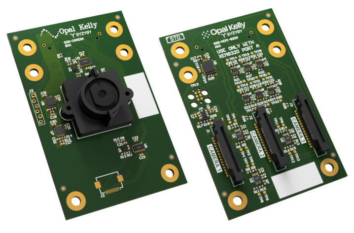

## Camera Example Design
- **Overview**
- [Getting Started](getting-started.md)
- [Hardware](hardware.md)
- [Gateware](gateware.md)
- [Software (C++)](software-cpp.md)
- [Software (JS)](software-js.md)
- [Schematics and Drawings](schematics-and-drawings.md)
- [Release Notes](release-notes.md)

The Camera Example Design hardware options include multiple cameras with support for various Opal Kelly FPGA Development Modules:

**EVB1005**

- XEM3010
- XEM3050
- XEM6010
- XEM6110
- XEM6310
- XEM7010
- XEM7310

**EVB1006**

- XEM6006
- XEM7350
- Other FMC carriers (untested)

**EVB1007**

- ZEM4310
- Other HSMC carriers (untested)

**[SZG-CAMERA](https://docs.opalkelly.com/syzygy-peripherals/szg-camera/)**

- Brain-1
- XEM7320
- XEM8320
- BRK8350
- BRK1900
- Other SYZYGY-compliant carriers (untested)

**[SZG-MIPI-8320](https://docs.opalkelly.com/syzygy-peripherals/szg-mipi-8320/)**

- XEM8320

The EVB1005/6/7 modules include a **Micron MT9P031I12STC** 5 Mpx color image sensor and necessary power supply circuitry.  Designed as evaluation boards for Opal Kelly integration modules, the modules provide an excellent platform for getting accustomed to the FrontPanel SDK.

The [SZG-CAMERA](https://opalkelly.com/products/szg-camera/) module, is also compatible with the Opal Kelly Camera Example Design and includes an **ON Semiconductor AR0330CM1C00SHAA0** 3.4 Mpx color image sensor.

# Documentation and Reference Materials

The following is a comprehensive list of documentation available for this device.

| | |
|---|---|
| [FrontPanel SDK User's Manual](https://docs.opalkelly.com/fpsdk/) | The online documentation space for the FrontPanel SDK. |
| [FrontPanel API Reference](https://library.opalkelly.com/library/FrontPanelAPI/) | Online API reference with detailed usage for every API method. |
| [Download Camera Example](https://github.com/opalkelly-opensource/Camera/releases?q=rtl) | Download the example design software and gateware through Github. |

# Copyright

Software, documentation, examples, and related materials are Copyright © 2006-2026 Opal Kelly Incorporated.

Opal Kelly Incorporated
Portland, OR
[https://www.opalkelly.com](https://www.opalkelly.com/)

All rights reserved. Unauthorized duplication, in whole or part, of this document by any means except for brief excerpts in published reviews is prohibited without the express written permission of Opal Kelly Incorporated.

Linux is a registered trademark of Linux Torvalds. Microsoft and Windows are both registered trademarks of Microsoft Corporation. All other trademarks referenced herein are the property of their respective owners and no trademark rights are claimed.
