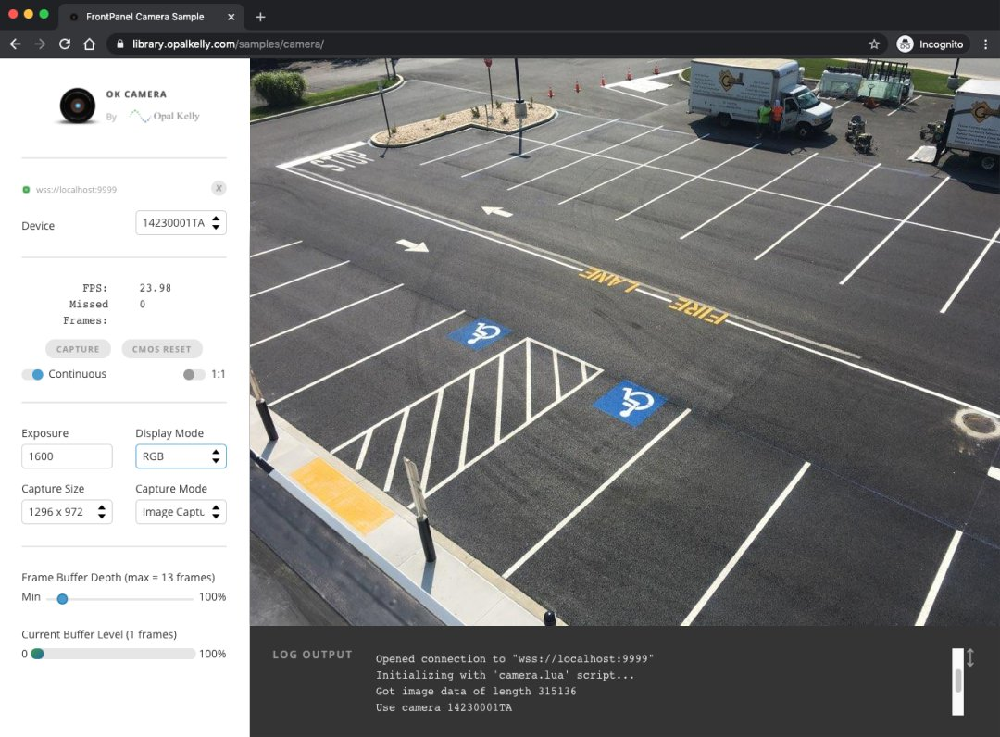

## Camera Example Design
- [Overview](overview.md)
- [Getting Started](getting-started.md)
- [Hardware](hardware.md)
- [Gateware](gateware.md)
- [Software (C++)](software-cpp.md)
- **Software (JS)**
- [Schematics and Drawings](schematics-and-drawings.md)
- [Release Notes](release-notes.md)

CameraApp-JS is a browser-based camera application for FrontPanel devices. Three motivators:

- **The web stack.** Fast iteration, polished UIs at low effort, no per-OS builds (Windows, macOS, Linux), and a deep library and tooling ecosystem.
- **Zero client setup.** No software to install or maintain on the operator's machine. A browser is everything they need.
- **Remote access.** FPoIP bridges browser and device, so the camera can sit at the point of interest (a lab bench, a remote installation).



Currently in Beta: feature-complete but may have glitches; report bugs to support@opalkelly.com.

Requires an FPoIP server with a minimum protocol version of 18 (supplied with FrontPanel 5.2.1 and later). Check the [Release Notes](release-notes.md) for hardware compatibility.

# Architecture

CameraApp-JS is a TypeScript web app built with NPM. The browser connects to the FPoIP server via the open-source [`@opalkelly/frontpanel-ws`](https://github.com/opalkelly-opensource/frontpanel-ws) package, a TypeScript FPoIP client implementing the same wire protocol the C++ SDK uses when connecting to remote devices. The same `camera.lua` server-side script the C++ remote path uses runs on the FPoIP server to collapse round-trips on high-latency links.

# Getting Started

The guides below set up everything locally on your machine for testing.

## Running from the Hosted Version

Easiest path. Use the Opal Kelly-hosted page (no download or self-hosting needed).

1. Start an FPoIP server. Requires:
   - [FrontPanel SDK](https://docs.opalkelly.com/fpsdk/introduction/): provides `fpoip-server` and `fpoip-passwd` (e.g. `C:\Program Files\Opal Kelly\FrontPanelUSB\` on Windows).
   - A tool to issue a browser-trusted cert. The example below uses [mkcert](https://github.com/FiloSottile/mkcert) (easy, cross-platform); any equivalent works.

   From a temporary working directory:

   ```
   # One-time: install a local CA, issue a localhost cert
   mkcert -install
   mkcert localhost

   # One-time: create a password file (adds username "user" with password "password")
   fpoip-passwd --create passwd user password

   # Start the server (default port 9999)
   fpoip-server --tlscert localhost.pem --tlskey localhost-key.pem --password passwd
   ```
2. Open [https://library.opalkelly.com/samples/camera/](https://library.opalkelly.com/samples/camera/) in your browser.
3. Connect to the FPoIP server. In the connect dialog:
   - URL: `localhost` (or any full URL like `wss://localhost:9999/`).
   - Username and Password: `user` and `password` from step 1.

## Running from the Pre-built Web App

Self-host the web app instead of using the Opal Kelly-hosted page (offline use or your own infrastructure).

1. Locate the [RTL Camera Example Design vX.Y.Z release (`rtl-vX.Y.Z`)](https://github.com/opalkelly-opensource/Camera/releases?q=rtl) on GitHub and download `Camera-ExampleDesign-vX.Y.Z-WebApp.zip`, then extract its contents.
2. Start an FPoIP server (see "Running from the Hosted Version" above).
3. Serve the application. From the directory containing `index.html`, run any static HTTP server (e.g. `python -m http.server 9889` or `npx serve -l 9889`), then open [http://localhost:9889/](http://localhost:9889/).
4. Connect to the FPoIP server (see "Running from the Hosted Version" above).

## Running from Source

For developers modifying the CameraApp-JS source.

1. Install dependencies (one-time). From `Software/Web`, run `npm install`.
2. Prepare the bitfiles. Locate the [RTL Camera Example Design vX.Y.Z release (`rtl-vX.Y.Z`)](https://github.com/opalkelly-opensource/Camera/releases?q=rtl) on GitHub and download `Camera-ExampleDesign-vX.Y.Z-Bitfiles.zip` (Windows) or `.tgz` (Linux), then extract it into `Software/Web/bitfiles/`.
3. Start an FPoIP server (see "Running from the Hosted Version" above).
4. Run the dev server. From `Software/Web`, run `npm start`, then open [http://localhost:9889/](http://localhost:9889/).
5. Connect to the FPoIP server (see "Running from the Hosted Version" above).

### Debug

Run `npm start`, then press F5 in VS Code (or F12 in Chrome) to start debugging.
